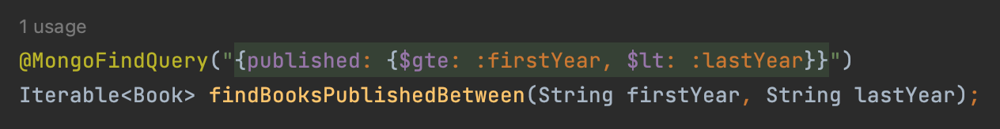
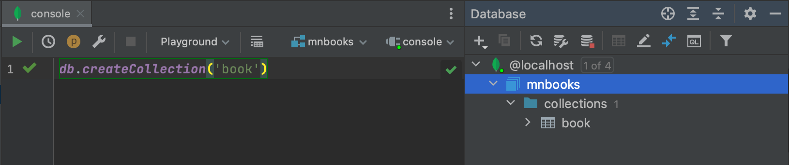

## Micronaut MongoDB Sample

This project is intended to demonstrate Micronaut MongoDB support in Intellij IDEA.

### Features

#### Gutter icon for entity to navigate to database

The gutter next to class name navigates to corresponding collection:


#### Gutter icons for fields to navigate to entity fields

There are gutters for entity properties to navigate to collection fields:


#### JSON Injection for Query Annotations with Parameter Highlighting

JSON language dialect is injected into Micronaut MongoDB query annotations
with parameters and operators highlighting:



#### Entity Field and Operators Completion

Entity fields and available operators are completed inside queries:


---

## Setup

### Docker Container Setup

1. Open the `Services` tool window and pull `mongo` docker image

    

2. Right-click on the pulled image and select `Create container`

    

3. Set a name for new container and bind ports

    

4. Run the created container

### MongoDB Setup

1. Add MongoDB datasource

    

2. Setup connection

    

3. Open DB console and create database with `use mnbooks`

    

4. Create a collection with `db.createCollection("book")`

    

5. Fulfill database with data from `db.js`

    

### Setup App Connection with DB

The connection is configured in the `application.yml` file:

```yaml
mongodb.uri: mongodb://${MONGO_HOST:localhost}:${MONGO_PORT:27017}/mnbooks
```

## Application API

There are few endpoints available to test the application:

